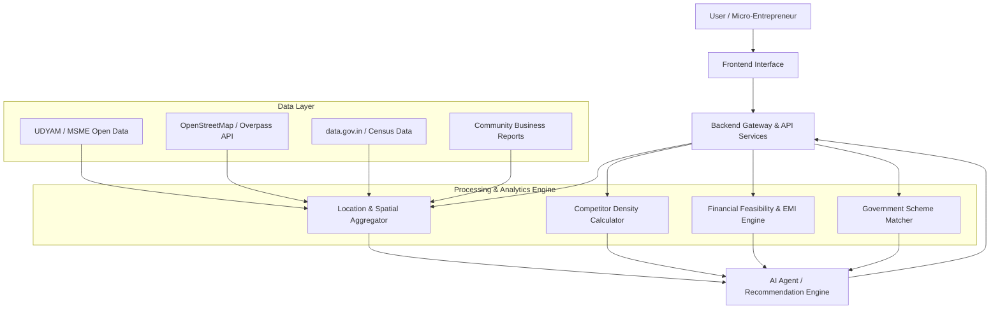

# SIH26091 - AI-Powered Hyper-Local Business Advisory & Financial Structuring Platform

> **Smart India Hackathon (SIH) 2026**  
> **Problem Statement ID:** SIH26091  
> **Target Audience:** Rural Micro-Entrepreneurs & Small Business Founders in India  
> **Development Status:** 🟡 Planned / Under Development (Architecture & Documentation Phase)

---

## 📌 Problem Statement Summary

Rural and semi-urban micro-entrepreneurs in India face severe information asymmetry when starting or expanding businesses. They lack access to:
1. **Hyper-local market data:** Inability to assess local demand, competitor saturation, or unserved customer needs.
2. **Financial structuring guidance:** Difficulty calculating project feasibility, working capital requirements, ROI, and loan EMI obligations.
3. **Government scheme awareness:** Fragmented information on government subsidies, grants, and credit-linked schemes (e.g., PMEGP, Mudra, PM-FME, Stand-Up India).

**SIH26091** aims to bridge this gap by building an AI-powered advisory platform tailored for rural entrepreneurs, integrating geographic intelligence, financial modeling, and automated scheme matching.

---

## 🎯 Main Objectives

* **Hyper-Local Intelligence:** Map official registered businesses and unorganized community-reported local shops to determine true local market capacity.
* **Automated Financial Structuring:** Compute realistic project capital costs, cash flow projections, break-even timelines, and loan repayment models.
* **Scheme Matching Engine:** Recommend eligible central and state government schemes based on business type, demographic profile, and investment size.
* **Deterministic AI Advisory:** Provide grounded, hallucination-free business advice backed by structured empirical data sources.

---

## ✨ Key Features

* **Hyper-Local Competitor Discovery:** Combines official MSME/UDYAM registries, OpenStreetMap spatial data, and community ground-truth reports to calculate competition density.
* **Confidence-Scored Data Transparency:** Explicitly labels business entries as *Government-Registered*, *Map-Discovered*, or *Community-Reported* with associated confidence scores.
* **Automated Financial Feasibility Engine:** Generates instant project reports with break-even analysis, operating expense estimates, and EMI schedules.
* **Targeted Government Scheme Matchmaker:** Filters scheme eligibility criteria dynamically based on location, sector, category, and capital requirements.
* **Multilingual & Low-Bandwidth Design (Planned):** Built to support regional Indian languages and low-connectivity environments.

---

## 🏗️ Architecture Overview



---

## 🧰 Technology Stack (Planned)

| Component | Technologies (Placeholder / Planned) |
| :--- | :--- |
| **Frontend** | React / Next.js, TailwindCSS, Progressive Web App (PWA) |
| **Backend** | Python (FastAPI / Django) |
| **Database** | PostgreSQL + PostGIS (Spatial Data), Redis (Caching) |
| **AI / Agent** | LangChain / LlamaIndex, Deterministic Tool Routing, LLM Engine |
| **Data & GIS** | OpenStreetMap Overpass API, GDAL/Shapely, Pandas |
| **Infrastructure** | Docker, GitHub Actions |

---

## 📁 Project Structure

```
SIH26091-AI-Business-Advisory/
│
├── README.md                   # Main Project Overview & Documentation Index
├── .gitignore                  # Environment & Dependency Ignores
├── LICENSE                     # MIT Open Source License
│
├── docs/                       # Comprehensive System Documentation
│   ├── problem-statement.md    # In-depth Problem Analysis
│   ├── solution-overview.md    # Platform Solution Details
│   ├── system-architecture.md  # Architectural Specifications
│   ├── data-sources.md         # Open Data & Spatial Sources Catalog
│   ├── ai-agent.md             # AI Tool Routing & Agent Architecture
│   ├── competitor-analysis.md  # Competitor Mapping & Confidence Scoring
│   ├── financial-analysis.md   # Financial & Credit Structuring Logic
│   ├── government-schemes.md   # Government Scheme Matching Engine
│   ├── database-design.md      # Relational & Spatial Entity Schemas
│   ├── api-documentation.md    # Planned REST & GIS API Routes
│   ├── testing-strategy.md     # QA, Security & Performance Strategy
│   └── research.md             # Domain Research Log & Findings
│
├── frontend/                   # Web Application Frontend (Planned)
├── backend/                    # Core REST API & Business Logic (Planned)
├── ai-agent/                   # AI Agent & Tool Execution Pipeline (Planned)
├── database/                  # Migrations & Spatial Database Scripts (Planned)
├── data/                       # Raw, Processed, and Sample Datasets
│   ├── raw/
│   ├── processed/
│   └── sample/
├── tests/                      # Automated Test Suite (Planned)
├── assets/                     # Media, Diagrams & Visual Assets
└── .github/                    # Issue Templates & PR Workflow
```

---

## 🚀 Development Status & Roadmap

* [x] **Phase 1: Problem Definition & Architecture Design** (Current)
* [ ] **Phase 2: Data Ingestion & Spatial Pipeline**
* [ ] **Phase 3: Financial & Scheme Matching Engine**
* [ ] **Phase 4: AI Agent Tool Integration**
* [ ] **Phase 5: Frontend Interface & Pilot Testing**

---

## 👥 Team Members

* **Team Lead:** *[To be updated]*
* **Backend & AI Engineer:** *[To be updated]*
* **Frontend Developer:** *[To be updated]*
* **Domain & Financial Researcher:** *[To be updated]*

---

## 📜 License

This project is licensed under the MIT License - see the [LICENSE](LICENSE) file for details.
