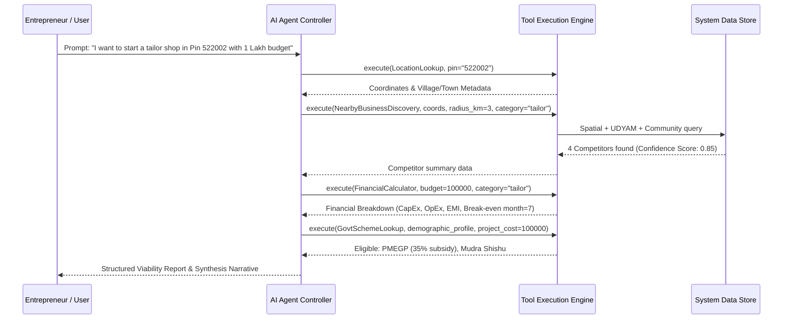

# AI Agent Architecture: SIH26091

## Overview
The AI Agent in SIH26091 operates as a **deterministic, tool-using advisory orchestrator**. Unlike open-ended conversational models that risk generating fabricated statistics or hallucinating non-existent government subsidies, this AI Agent is strictly constrained to executing verified internal calculation tools and summarizing structured data outputs.

---

## 🤖 Agent Execution Architecture

---

## 🛠️ Planned Agent Tools & Modules

### 1. `LocationLookupTool`
* **Function:** Resolves pin codes, village names, and district identifiers into geographic coordinates and administrative boundaries.
* **Input:** Location text / Pin Code.
* **Output:** Latitude, longitude, District, Block, State, LGD Code.

### 2. `NearbyBusinessDiscoveryTool`
* **Function:** Queries spatial database for existing competitors within a selected radius.
* **Input:** Coordinates, radius in kilometers, business category.
* **Output:** Competitor count, distribution map, confidence breakdown.

### 3. `UDYAMRegistryLookupTool`
* **Function:** Checks registered enterprise density by NIC sector code for the target district.
* **Input:** District name, NIC sector code.
* **Output:** Registered micro/small business counts.

### 4. `PopulationDemographicTool`
* **Function:** Fetches population figures and worker ratios from census databases.
* **Input:** Village / Pin code location ID.
* **Output:** Total population, household count, estimated market demand index.

### 5. `CompetitorAnalysisTool`
* **Function:** Synthesizes competitor entries across source categories (Govt registered, map discovered, community reported) into a market saturation score.
* **Input:** Raw business listings array.
* **Output:** Saturation Index (Low / Medium / High / Critical).

### 6. `FinancialCalculatorTool`
* **Function:** Performs deterministic accounting calculations.
* **Input:** Project cost, beneficiary contribution, loan interest rate, loan tenure.
* **Output:** Loan principal, monthly EMI, fixed costs, variable costs, monthly break-even sales target.

### 7. `GovtSchemeLookupTool`
* **Function:** Evaluates user demographic profile and project cost against scheme rule matrices.
* **Input:** User profile (age, category, gender, location type, cost).
* **Output:** Matched scheme list, subsidy amount, bank loan portion, application link.

### 8. `RecommendationGeneratorTool`
* **Function:** Formulates final advisory summary based strictly on tool-computed data.
* **Input:** Outputs from all preceding tools.
* **Output:** Structured JSON advisory report and plain-language summary.

---

## 🛑 Anti-Hallucination & Safety Guardrails

1. **No External Fact Invention:** The LLM prompt template forbids providing financial figures or scheme subsidy percentages not present in tool outputs.
2. **Explicit Data Fallbacks:** If spatial data for a village is limited, the agent clearly states: *"Data limited for this village; advice based on district averages."*
3. **Traceable Explanations:** Every claim (e.g., "High competition") links directly to the underlying metric (e.g., "5 tailor shops within 1.5 km radius").
