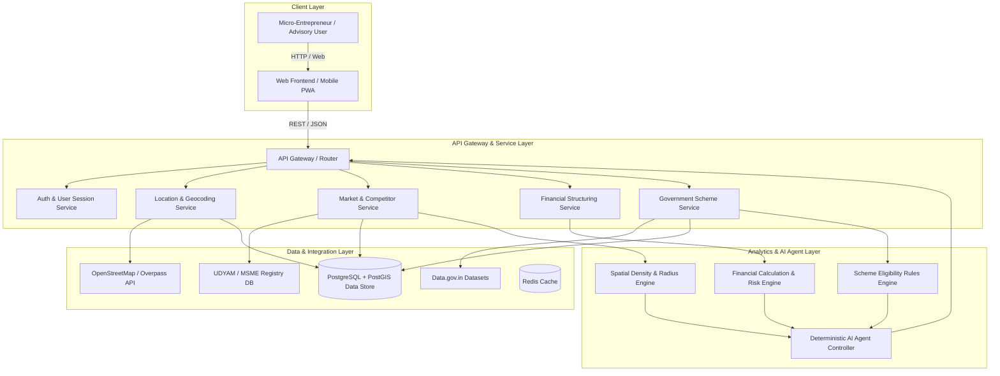

# System Architecture: SIH26091

## Planned Architecture Overview
The platform follows a modular, decoupled microservices architecture designed to decouple spatial data processing, financial calculations, and AI decision-making.

---

## 🏗️ Layer Specifications

### 1. Client Layer (Frontend)
* Responsive Web Application optimized for mobile viewports and low-bandwidth connections.
* Interactive map visualization for local competitor mapping and radius selection.
* Multilingual UI components for regional language accessibility.

### 2. API Gateway & Router Layer
* Serves as the single entry point for client requests.
* Handles routing, rate limiting, request validation, and user authentication.
* Communicates downstream to internal modular services.

### 3. Location & Data Integration Layer
* **Geocoding & Spatial Boundaries:** Translates pin codes, village names, and GPS coordinates into lat/long coordinates.
* **OpenStreetMap / Overpass API:** Queries points of interest (POIs) such as commercial shops, markets, roads, and transit hubs.
* **UDYAM / MSME Registry:** Accesses open database entries of registered enterprises.
* **Community Data Store:** Ingests crowd-sourced business reports submitted by local users.

### 4. Data Processing & Analytics Layer
* **Spatial Density Engine:** Executes radial queries (e.g., 1km, 3km, 5km buffers) around user coordinates to count existing businesses by category.
* **Financial Calculator Engine:** Computes project capital budgets, debt ratio, monthly cash flows, EMI, break-even month, and sensitivity factors.
* **Scheme Eligibility Rules Engine:** Evaluates demographic criteria (age, gender, social category) and project parameters against official scheme eligibility conditions.

### 5. AI Agent & Recommendation Layer
* Orchestrates call sequences between spatial, financial, and scheme tools.
* Formulates a structured JSON response containing quantitative metrics.
* Generates human-readable, plain-language advisory narratives explaining the business viability without hallucinating underlying facts.

---

## 🔒 Security & Performance Considerations

* **API Caching:** Redis caching for spatial queries and scheme lookup data to minimize external API latency.
* **Data Privacy:** User financial profiles and location queries encrypted in transit (TLS 1.3) and at rest (AES-256).
* **Stateless Agent Tools:** AI Agent functions strictly as a tool caller over verified backend outputs.
